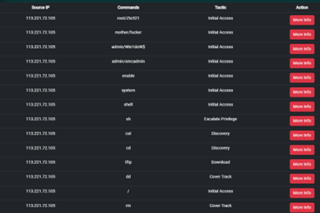

# AI-Powered Threat Detection
> An advanced cybersecurity solution using machine learning for real-time threat analysis and detection.

Our AI-powered threat detection that leverages advanced Machine Learning algorithms to identify and classify cyber-attacks with precision. By analyzing patterns and behaviors, the system detects the tactics employed by attackers, enabling proactive threat response and mitigation. This innovative approach not only enhances network and Infrastructure.

## 🎥 Demo
https://github.com/user-attachments/assets/99e8f23d-bde6-456b-88d4-eedd0d7c2476

**Key Features Demonstrated:**
- Real-time threat detection and analysis
- Automated data processing workflow
- Interactive dashboard navigation
- Detailed threat analysis capabilities

## 📚 Usage Guide

### 1. Data Conversion
```
Extract .gz files to CSV format for preprocessing
```


### 2. Data Preprocessing
```
Clean and prepare your dataset
```


### 3. Model Execution
```
Run the LSTM model for threat classification
```


### 4. Dashboard Interface
```
Monitor and analyze threats through the interactive dashboard
```
<div align="center">
  
</div>

### Threats Exploiting Tactic
```
Upon ML model completion, a dashboard displays recent threats with Source IP, Commands, Tactic, and an Action button.

```
<div align="center">
  
</div>

### Threat Analysis Table
```
View detailed information about detected threats
```
<div align="center">
  
</div>

### Detailed Information
```
Access comprehensive threat insights and analytics
```
<div align="center">
  
</div>

## ⚡ Quick Start
1. **Clone Repository**
   ```bash
   git clone git@github.com:Mugeshcybersecurity/AI-powered-threat-detection.git
   ```

2. **Install Dependencies**
   ```bash
   npm install
   ```

3. **Configure API**
   ```json
   {
     "apiKey": "YOUR_API_KEY"
   }
   ```

4. **Launch Application**
   ```bash
   node index.js
   ```

## 💻 System Requirements
| Component    | Minimum Requirement    |
|-------------|------------------------|
| Processor   | AMD Ryzen 5 5625U     |
| RAM         | 4 To 8GB                   |
| OS          | Windows            |
| Storage     | 65 min           |

## 🔧 Troubleshooting
- Verify input file format (`cowrie.json.x.gz`)
- Check all dependencies are installed
- Validate API key configuration
- Monitor system resources

## 📞 Support
Need help? [Open an issue](https://github.com/Mugeshcybersecurity/AI-powered-threat-detection/issues) or contact our support team.

---
<div align="center">
  Made with 💙 by Mugesh
  <br>
  MIT License
</div>
